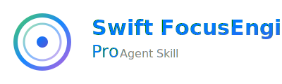

<p align="center">
  
</p>

<h3 align="center">适用于所有 Apple 平台的焦点管理代理技能</h3>

<p align="center">
  
  
  
  
  
  
  
  
</p>

<p align="center">
  <a href="https://skills.sh/mhaviv/Swift-FocusEngine-Agent-Skill">
    
  </a>
  <a href="https://github.com/twostraws/Swift-Agent-Skills">
    
  </a>
  <a href="https://www.awesomeskills.dev/en/skill/mhaviv-swift-focusengine-agent-skill">
    
  </a>
  <a href="https://github.com/mhaviv/Swift-FocusEngine-Agent-Skill/stargazers">
    
  </a>
</p>

<p align="center">
  <a href="https://x.com/michael_haviv">
    
  </a>
  <a href="https://www.linkedin.com/in/michaelhaviv/">
    
  </a>
</p>

---

Swift FocusEngine Pro 是一个免费、开源的代理技能，帮助 AI 编码助手为 **tvOS**、**iOS/iPadOS**、**watchOS**、**visionOS** 和 **macOS** 编写正确的焦点管理代码。它涵盖 SwiftUI、UIKit、AppKit 和 RealityKit——针对 LLM 在使用 Apple 焦点引擎时实际犯的错误。

基于发布生产级 tvOS 应用的真实经验、Apple 开发者文档、WWDC 会议（2017-2025），以及来自 Airbnb、Showmax 等的社区最佳实践构建。

兼容 [Claude Code](https://claude.ai/code)、[Codex](https://openai.com/codex)、[Cursor](https://cursor.sh)、[GitHub Copilot](https://github.com/features/copilot)、[Gemini CLI](https://github.com/google-gemini/gemini-cli)，以及任何支持 [Agent Skills](https://agentskills.io) 格式的工具。

## 目录

- [适用对象](#适用对象)
- [为什么使用焦点代理技能？](#为什么使用焦点代理技能)
- [安装](#安装)
- [使用](#使用)
- [涵盖内容](#涵盖内容)
- [捕获的反模式](#捕获的反模式)
- [常见问题](#常见问题)
- [来源](#来源)
- [互补技能](#互补技能)
- [更新日志](#更新日志)
- [贡献](#贡献)
- [许可证](#许可证)

## 适用对象

- **tvOS 开发者**——构建每个交互都依赖焦点引擎正确工作的应用
- **iOS/iPadOS 开发者**——添加键盘、游戏手柄或外接显示器支持，使用焦点组
- **visionOS 开发者**——在空间计算中探索注视、悬停和焦点之间的差异
- **macOS 开发者**——构建支持键盘导航的应用，使用键视图循环、焦点环和菜单命令

## 为什么使用焦点代理技能？

Apple 平台上的焦点管理是最难正确实现的事情之一——也是出问题时最难调试的事情之一。

焦点引擎是几何性的，而非层次性的。它不遵循你的视图树。当用户向右滑动，焦点跳到两行之外而不是下一个项目时，没有错误、没有崩溃、没有日志——它就是看起来坏了。项目没有完美地垂直对齐，所以引擎选择了不同的候选者。你会在 `UIFocusDebugger` 中花上好几个小时才能弄清楚原因。

Apple 的文档涵盖了 API，但没有涵盖实际边缘情况：重新加载数据时焦点重置到顶部会发生什么、为什么 `.disabled()` 在 tvOS 上会静默地从焦点链中移除视图、为什么 `.focusSection()` 是可用滚动视图和混乱之间的区别、或者为什么 `onHover` 在 visionOS 上不会从眼睛注视触发。

LLM 生成的焦点代码能编译通过、看起来合理——但只在真实设备上手持 Siri Remote 时才会发现它以某种方式崩溃。这个技能基于我在复杂的生产级 tvOS 应用中让焦点真正工作的经验。这里的每个反模式都是我遇到、调试和修复过的问题。

## 安装

### Claude Code

```bash
# 全局（所有项目）
npx skills add https://github.com/mhaviv/Swift-FocusEngine-Agent-Skill --skill swift-focusengine-pro -g -y

# 仅项目级别
npx skills add https://github.com/mhaviv/Swift-FocusEngine-Agent-Skill --skill swift-focusengine-pro -y
```

### Codex

```bash
npx skills add https://github.com/mhaviv/Swift-FocusEngine-Agent-Skill --skill swift-focusengine-pro --agent codex
```

### Cursor

```bash
npx skills add https://github.com/mhaviv/Swift-FocusEngine-Agent-Skill --skill swift-focusengine-pro --agent cursor
```

### GitHub Copilot

```bash
npx skills add https://github.com/mhaviv/Swift-FocusEngine-Agent-Skill --skill swift-focusengine-pro --agent github-copilot
```

### Gemini CLI

```bash
npx skills add https://github.com/mhaviv/Swift-FocusEngine-Agent-Skill --skill swift-focusengine-pro --agent gemini
```

### 其他代理

任何支持 [Agent Skills](https://agentskills.io) 格式的代理都可以使用此技能。有关向你的代理添加技能的说明，请参阅 [agentskills.io](https://agentskills.io)。

<details>
<summary>没有安装 Node？</summary>

```bash
brew install node
```

或从 [nodejs.org](https://nodejs.org) 下载。
</details>

### 更新

技能以本地副本形式安装——它们不会自动更新。要拉取最新版本：

```bash
# 更新所有已安装的技能
npx skills update -g -y

# 或专门重新安装此技能
npx skills add https://github.com/mhaviv/Swift-FocusEngine-Agent-Skill --skill swift-focusengine-pro -g -y
```

⭐ **星标和关注**此仓库以获取新版本通知。

## 使用

### Claude Code
```
/swift-focusengine-pro 审查此视图的 tvOS 焦点问题
```

### Codex
```
$swift-focusengine-pro 检查我的 SwiftUI 代码是否有焦点反模式
```

### Cursor
```
/swift-focusengine-pro 审查此视图的 tvOS 焦点问题
```

### GitHub Copilot
```
/swift-focusengine-pro 审查此视图的 tvOS 焦点问题
```

### Gemini CLI
```
使用 swift-focusengine-pro 技能审查我的焦点处理代码
```

### 任何代理
> 使用 Swift FocusEngine Pro 技能审计我的项目的焦点管理问题

### 示例提示

- *"为什么我的视图出现时第一个项目没有获得焦点？"*
- *"我向右滑动时焦点跳到了完全不同的行——项目没有完美地垂直对齐"*
- *"数据重新加载后如何保持焦点位置？"*
- *"我给按钮加了 .disabled()，但现在焦点跳过了整个部分"*
- *"visionOS 上注视和焦点有什么区别？"*
- *"重新排列视图修饰符后 Digital Crown 旋转停止工作了"*
- *"如何让菜单栏命令响应当前聚焦的文档窗口？"*

## 涵盖内容

### 14 个参考文件中 4,500+ 行焦点专业知识（v1.6）

| 参考文件 | 平台 | 覆盖范围 |
|-----------|----------|----------|
| **anti-patterns.md** | 全部 | 30 个关键错误：17 个原始 tvOS + 6 个生产级 tvOS + 7 个 macOS 特定 |
| **swiftui-focus.md** | tvOS | @FocusState、focusSection、prefersDefaultFocus、AutoFocusManager 模式 |
| **uikit-focus.md** | tvOS | UIFocusEnvironment、UIFocusGuide、shouldUpdateFocus、didUpdateFocus |
| **ios-focus.md** | iOS/iPadOS | SwiftUI + UIKit：焦点组、focusGroupIdentifier、UIFocusHaloEffect、键盘导航、focusedValue、游戏手柄、Stage Manager |
| **watchos-focus.md** | watchOS | SwiftUI：Digital Crown 路由、顺序焦点、Crown 冲突、.digitalCrownAccessory |
| **visionos-focus.md** | visionOS | SwiftUI + UIKit + RealityKit：注视 vs 悬停 vs 焦点、HoverEffect、HoverEffectComponent |
| **focus-styling.md** | 全部 | ButtonStyle + isFocused、FocusBorder、CABasicAnimation、CardButtonStyle、macOS 焦点环样式 |
| **focus-restoration.md** | 全部 | 数据重新加载处理、安全重载模式、行偏移跟踪 |
| **layout-patterns.md** | tvOS | 集合表格、侧边栏+内容、标签栏、英雄+目录 |
| **macos-focus.md** | macOS | AppKit + SwiftUI：键视图循环、焦点环、NSView 焦点 API、菜单的 focusedValue、Mac Catalyst、完全键盘访问 |
| **realitykit-focus.md** | visionOS | RealityKit 实体悬停、碰撞形状、手势、着色器效果、混合层次结构 |
| **async-focus.md** | 全部 | @MainActor 协调、数据加载后焦点、NavigationStack 返回、Task 取消 |
| **accessibility-focus.md** | 全部 | @AccessibilityFocusState、VoiceOver + 焦点、完全键盘访问、Switch Control、减弱动态效果 |
| **debugging.md** | 全部 | UIFocusDebugger、_whyIsThisViewNotFocusable、启动参数、macOS 第一响应者调试 |

## 捕获的反模式

### 阻塞性（发布前必须修复）

1. **`.disabled()` 在 tvOS 上将视图从焦点链中移除**——改为在闭包内门控操作（`.allowsHitTesting(false)` 不可靠）
2. **水平 ScrollView 上缺少 `.focusSection()`**——导致垂直布局中跨行焦点跳跃
3. **向 Buttons 或 NavigationLinks 添加 `.focusable()`**——创建双重焦点伪影
4. **在同一层次结构中混合 SwiftUI 和 UIKit 焦点**——焦点环境冲突
5. **动画期间调用 `reloadData()`**——焦点重置到屏幕顶部
6. **在焦点变换计算中使用 `frame.width`**——聚焦时尺寸会变化
7. **从错误的环境调用 `setNeedsFocusUpdate()`**——静默失败，无错误
8. **在标题/标签上设置 `isUserInteractionEnabled = false`**——将它们及其子视图从焦点链中移除
9. **`remembersLastFocusedIndexPath` + 离屏 `reloadData()`**——记住的索引可能不再存在
10. **对 CALayer 属性使用 `UIView.animate`**——动画不起作用，请使用 `CABasicAnimation`

### 警告性（应该修复）

11. **非可选 `@FocusState` 与 `focused(_:equals:)`**——无法表示"无焦点"状态
12. **缺少 `prepareForReuse()` 焦点状态清理**——重用单元格上的陈旧焦点样式
13. **ScrollView 内的 `prefersDefaultFocus`**——可能不如预期工作，请改用 `defaultFocus`
14. **Apple TV HD 上的 LazyVStack/LazyVGrid 性能**——A8 芯片无法处理快速滚动时的懒加载布局重计算

### tvOS 生产模式

15. **`LazyVStack` 释放离屏行**——快速向上滑动导致焦点跳到标签栏，跳过内容
16. **垂直 ScrollView 上缺少 `.focusSection()`**——焦点向上逃逸到标签栏/导航栏
17. **在 `didUpdateFocus`/`shouldUpdateFocus` 中分配对象**——每帧垃圾回收导致微卡顿

### macOS 特定

18. **自定义 NSView 上未重写 `acceptsFirstResponder`**——视图对 Tab 导航不可见
19. **不完整的键视图循环**——到达最后一个视图后 Tab 停止工作
20. **直接调用 `becomeFirstResponder()`**——绕过辞职/成为握手，请使用 `window.makeFirstResponder`
21. **NSPanel 窃取焦点**——检查器面板从文档窗口获取焦点，请使用 `becomesKeyOnlyIfNeeded`
22. **sheet/alert 后未恢复焦点**——焦点丢失到窗口而非返回原始视图
23. **NSViewRepresentable 上的 `.focusable()`**——创建与 AppKit 冲突的双重焦点层
24. **菜单项未检查 nil focusedValue**——无窗口为关键窗口时崩溃

## 常见问题

<details>
<summary><strong>如何在 tvOS 上为特定视图设置初始焦点？</strong></summary>

在 SwiftUI 中，使用 `defaultFocus(_:_:)` 或 `prefersDefaultFocus`。在 UIKit 中，在父视图控制器上重写 `preferredFocusEnvironments`。参见 [swiftui-focus.md](references/swiftui-focus.md) 和 [uikit-focus.md](references/uikit-focus.md)。
</details>

<details>
<summary><strong>reloadData 后焦点重置——如何保持焦点位置？</strong></summary>

使用 `remembersLastFocusedIndexPath` 或在重载前锁定焦点的安全重载模式。参见 [focus-restoration.md](references/focus-restoration.md)。
</details>

<details>
<summary><strong>向右滑动时焦点跳到错误的行</strong></summary>

焦点引擎是几何性的，而非层次性的。向水平 ScrollView 添加 `.focusSection()` 以将焦点保持在行内。参见 [anti-patterns.md](references/anti-patterns.md)（模式 #2）。
</details>

<details>
<summary><strong>如何以编程方式移动焦点？</strong></summary>

你不能直接设置焦点。重写 `preferredFocusEnvironments` 返回目标，然后在正确的焦点环境上调用 `setNeedsFocusUpdate()` + `updateFocusIfNeeded()`。参见 [uikit-focus.md](references/uikit-focus.md)。
</details>

<details>
<summary><strong>UIFocusGuide 不起作用</strong></summary>

常见原因：指南未添加到视图层次结构、指南上未设置 `preferredFocusEnvironments`、或尺寸/定位不正确。焦点指南用于弥合可聚焦视图之间的空白。参见 [uikit-focus.md](references/uikit-focus.md)。
</details>

<details>
<summary><strong>focusSection() 到底做什么？</strong></summary>

它创建一个焦点组，引擎将其视为连续区域，防止焦点跳过该区域到其他行的项目。对于垂直布局中的水平 ScrollView 至关重要。参见 [swiftui-focus.md](references/swiftui-focus.md)。
</details>

<details>
<summary><strong>如何在 tvOS 上调试焦点问题？</strong></summary>

在调试器中使用 `UIFocusDebugger.checkFocusability(for:)`，在任何 UIView 上使用 `_whyIsThisViewNotFocusable`，以及 `UIFocusLoggingEnabled` 启动参数。参见 [debugging.md](references/debugging.md)。
</details>

<details>
<summary><strong>为什么 .disabled() 在 Apple TV 上会破坏焦点？</strong></summary>

在 tvOS 上，`.disabled()` 将视图从焦点链中完全移除。`.allowsHitTesting(false)` 通常被推荐但不可靠——它可能在底层映射为 `isUserInteractionEnabled = false`。最可靠的方法是在按钮闭包内门控操作，而非禁用视图。对于列表/侧边栏，使用双重 `@FocusState` + `.disabled()` 门控模式（反模式 #25）。参见 [anti-patterns.md](references/anti-patterns.md)（模式 #1 和 #25）。
</details>

<details>
<summary><strong>@FocusState 在 iOS 上不收起键盘</strong></summary>

将 `@FocusState` 设置为 `nil` 应该收起键盘，但在 sheet 或 NavigationStack 中可能失败。参见 [ios-focus.md](references/ios-focus.md) 了解变通方案。
</details>

<details>
<summary><strong>如何用键盘下一步按钮在 TextField 之间移动焦点？</strong></summary>

使用 `@FocusState` 和表示每个字段的枚举，然后在 `onSubmit` 中设置下一个 case。参见 [ios-focus.md](references/ios-focus.md)。
</details>

<details>
<summary><strong>iPad 上键盘焦点导航如何工作？</strong></summary>

iOS 15+ 添加了对硬件键盘的 UIFocusSystem 支持。通过 `UIFocusHaloEffect`、`focusGroupIdentifier` 和 `focusEffect` 启用。参见 [ios-focus.md](references/ios-focus.md)。
</details>

<details>
<summary><strong>Stage Manager 下 iPad 多窗口焦点如何工作？</strong></summary>

每个窗口场景有自己的焦点状态。使用 `focusedSceneValue` 跨场景传播焦点信息。参见 [ios-focus.md](references/ios-focus.md)（Stage Manager 部分）。
</details>

<details>
<summary><strong>如何为多窗口 iPad 应用使用 focusedSceneValue？</strong></summary>

定义一个 `FocusedValueKey`，用 `.focusedSceneValue()` 设置值，然后在菜单栏或工具栏命令中用 `@FocusedValue` 读取。参见 [ios-focus.md](references/ios-focus.md)。
</details>

<details>
<summary><strong>重新排列视图修饰符后 Digital Crown 旋转停止工作</strong></summary>

`.digitalCrownRotation()` 修饰符对顺序敏感。它必须相对于其他修饰符应用在正确的位置。参见 [watchos-focus.md](references/watchos-focus.md)。
</details>

<details>
<summary><strong>如何处理 Digital Crown 的嵌套滚动冲突？</strong></summary>

当 ScrollView 包含 Digital Crown 控件时，Crown 同时驱动滚动和控件。使用显式 `@FocusState` 确定哪个元素拥有 Crown。参见 [watchos-focus.md](references/watchos-focus.md)。
</details>

<details>
<summary><strong>visionOS 上悬停和焦点有什么区别？</strong></summary>

visionOS 使用眼睛追踪进行悬停（`.hoverEffect()`），使用间接输入进行焦点。它们是独立的系统。注视产生悬停高亮，但激活需要轻捏手势。参见 [visionos-focus.md](references/visionos-focus.md)。
</details>

<details>
<summary><strong>如何在 visionOS 中自定义悬停效果？</strong></summary>

在 RealityKit 实体上使用 `HoverEffectComponent`，样式包括：default、spotlight、shader 或 highlight。对于 SwiftUI 视图，使用 `.hoverEffect(.highlight)` 或 `.hoverEffect(.lift)`。参见 [realitykit-focus.md](references/realitykit-focus.md)。
</details>

<details>
<summary><strong>Mac Catalyst 应用中焦点如何工作？</strong></summary>

Mac Catalyst 继承 iPad 的 `UIFocusSystem`——`UIFocusHaloEffect` 渲染为 macOS 焦点环，`focusGroupIdentifier` 映射到 Tab 导航组。如果你的 iPad 应用不支持键盘焦点，Catalyst 版本也不会支持。参见 [macos-focus.md](references/macos-focus.md)（Mac Catalyst 部分）。
</details>

<details>
<summary><strong>如何在 macOS SwiftUI 应用中处理键盘焦点？</strong></summary>

使用 `@FocusState`（与 iOS 相同）和 `.focusable()` 用于自定义视图。macOS 焦点始终激活——无需硬件键盘。对于菜单栏集成，使用 `focusedValue` / `focusedSceneValue`。参见 [macos-focus.md](references/macos-focus.md)。
</details>

<details>
<summary><strong>焦点在模拟器上工作但在设备上不工作（或反之）</strong></summary>

焦点引擎在 Xcode 模拟器和物理硬件之间表现不同，特别是 tvOS 遥控器手势和 visionOS 眼睛追踪。始终在真实设备上测试焦点。参见 [debugging.md](references/debugging.md)。
</details>

## 来源

基于以下构建：
- Apple 开发者文档（UIFocusEnvironment、UIFocusGuide、FocusState、focusSection、HoverEffect）
- WWDC17：tvOS 11 中的焦点交互
- WWDC21：SwiftUI 中的直接和反射焦点 + iPad 键盘导航焦点
- WWDC23：SwiftUI 焦点手册
- WWDC24：在 visionOS 中创建自定义悬停效果
- WWDC25：为 visionOS 设计悬停交互
- 具有复杂焦点需求的生产级 tvOS 应用
- 社区指南（Airbnb、Showmax、Fatbobman、Big Nerd Ranch）

## 互补技能

Swift FocusEngine Pro 与以下技能配合良好：

- [SwiftUI Pro](https://github.com/twostraws/SwiftUI-Agent-Skill) by Paul Hudson——SwiftUI 最佳实践和模式
- [Swift Concurrency Pro](https://github.com/twostraws/Swift-Concurrency-Agent-Skill) by Paul Hudson——async/await、actors、Sendable
- [Swift Concurrency](https://github.com/AvdLee/Swift-Concurrency-Agent-Skill) by Antoine van der Lee——Swift 6 迁移、数据竞争预防
- [Xcode Build Optimization](https://github.com/AvdLee/Xcode-Build-Optimization-Agent-Skill) by Antoine van der Lee——构建基准测试和优化

更多技能请参见 [Swift Agent Skills](https://github.com/twostraws/Swift-Agent-Skills) 目录。

## 更新日志

发布历史请参见 [CHANGELOG.md](CHANGELOG.md)。

## 贡献

欢迎贡献！重点关注：

- **边缘情况**——让开发者措手不及的非显而易见的焦点行为
- **新平台 API**——iOS 19、tvOS 19、visionOS 3、watchOS 12、macOS 16 的新增内容
- **真实世界模式**——来自生产应用的经过实战检验的解决方案
- **反模式**——LLM 常犯的错误

保持参考文件聚焦，每个不超过 300 行。不要重复 LLM 已经知道的内容——专注于它们弄错的地方。所有贡献必须采用 MIT 许可证。

在贡献之前，请阅读[行为准则](CODE_OF_CONDUCT.md)。

## 许可证

Swift FocusEngine Pro 由 [Michael Haviv](https://github.com/mhaviv) 创建，采用 [MIT 许可证](LICENSE)授权。
